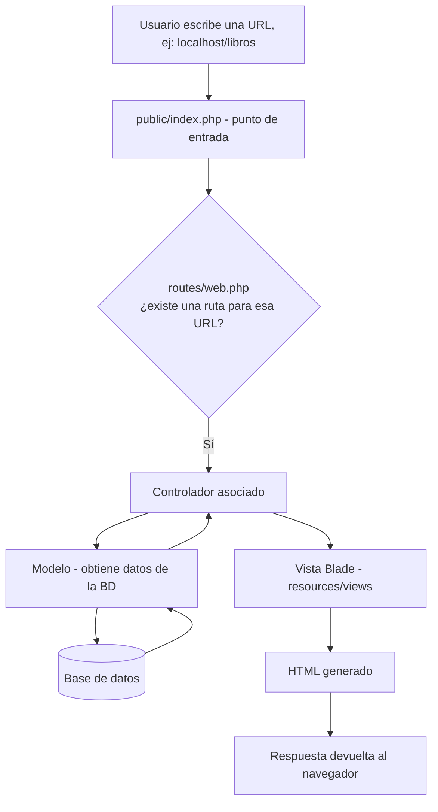

# Análisis y Documentación del Proyecto: SGE Biblioteca COTECNOVA

Documento de análisis y documentación técnica del **Sistema de Gestión de Préstamos para la Biblioteca COTECNOVA**.
## Contenido

1. [Capítulo 1: Análisis de la Empresa](#capítulo-1-análisis-de-la-empresa): datos generales, procesos, entidades, diccionario de datos, MER, requerimientos y marco del proyecto integrador
2. [Capítulo 2: Instalación de Laravel](#capítulo-2-instalación-de-laravel): requisitos, instalación con Sail, estructura, MVC y variables de entorno
3. [Capítulo 3: Documentación Visual del Proyecto](#capítulo-3-documentación-visual-del-proyecto)
4. [Capítulo 4: Estructura del Proyecto, Modelos, Autenticación y Seeders](#capítulo-4-estructura-del-proyecto-modelos-autenticación-y-seeders-semana-4)
5. [Capítulo 5: Módulo CRUD de Libros y estado del entregable](#capítulo-5-módulo-crud-de-libros-clase-5-y-estado-del-entregable)

Documentos relacionados: [`diccionario.md`](diccionario.md) (diccionario de datos) y [`diagrama_mer.jpeg`](diagrama_mer.jpeg) (diagrama entidad-relación).

---

# Capítulo 1: Análisis de la Empresa

## 1. Datos Generales

- **Nombre:** Biblioteca COTECNOVA
- **Giro del negocio:** Gestión del catálogo bibliográfico y administración del préstamo e inventario de libros de una biblioteca institucional de educación superior.
- **Tamaño:** Pequeña

### 1.1 Ficha del proyecto integrador

| Parámetro | Valor |
|---|---|
| Título del proyecto integrador | Sistema de Gestión de Préstamos para la Biblioteca COTECNOVA |
| Fecha de la propuesta | 29/05/2026 |
| Programa académico | Tecnología en Sistemas de Información |
| Nivel de formación | Tecnología |
| Integrantes | Alejandra Díaz Velásquez y Manuela Aguirre Toro |
| Sede de aplicación | Biblioteca de COTECNOVA, Cartago (Valle del Cauca) |
| Año de ejecución | 2026 |
| Relación con este repositorio | El SGE es el prototipo de software del proyecto integrador; en este primer corte se entrega la base del catálogo (libros, editoriales, géneros y usuarios) y el diseño completo del modelo de datos. |

### 1.2 Descripción de la empresa

La Biblioteca COTECNOVA de Cartago, Valle del Cauca presta material bibliográfico a estudiantes y docentes de los programas presenciales, su acervo es de **7.869 libros**, y el servicio lo atiende un equipo pequeño: en el estudio participan 2 bibliotecarios (encargado del 2025 y del 2026), y esa es una de las razones por las que la clasificamos como empresa **pequeña**. Su operación gira alrededor de un solo servicio: prestamos y devoluciones de material bibliográfico.

### 1.3 Diagnóstico del problema

Hoy la biblioteca gestiona los préstamos y las devoluciones de forma manual.
| # | Problema | Evidencia y consecuencia |
|---|---|---|
| 1 | Préstamos en papel | Se registran en formularios físicos llamados "PLANILLA DE REGISTRO PRÉSTAMO MATERIAL BIBLIOGRÁFICO". Esto produce demoras al buscar un registro, desgaste de los formatos y errores en el control de disponibilidad. |
| 2 | Acervo sin procesar completo | De los 7.869 libros, solo unos 5.313 están correctamente procesados en el aplicativo institucional. Quedan cerca de 2.556 (alrededor de un tercio) por fuera de una consulta confiable. |
| 3 | Dos fuentes de datos separadas | La bibliotecaria anterior mantenía un archivo paralelo en Excel con unos 1.334 libros para tener un control más detallado. La información está partida entre el aplicativo, el Excel y el papel. |
| 4 | Página web institucional limitada | La búsqueda avanzada falla, no permite reservar en línea y no muestra el estado del libro (prestado o disponible). El usuario tiene que ir a la biblioteca sin saber si va a encontrar el material. |
| 5 | Crecimiento de la demanda | La institución crece y abre nuevos programas presenciales, lo que aumenta el uso de la biblioteca y deja el servicio actual corto. |

## 2. Procesos Clave

### 2.1 Ventas (préstamo, devolución y multas)

La biblioteca no vende. El proceso que cumple el papel de las ventas es el **servicio de préstamo**, y de él depende casi todo el resto del sistema. Cada préstamo registra la fecha de préstamo, la fecha límite de devolución, la fecha real de devolución y, si aplica, el valor de la multa por retraso. El dashboard calcula sobre esos datos indicadores como préstamos activos, préstamos vencidos y multas pendientes.

**Cómo funciona hoy (sin el sistema):** el usuario va a la biblioteca a preguntar si el libro está; el bibliotecario lo busca en el aplicativo institucional o en el Excel paralelo; el préstamo se anota a mano en la planilla física; y en la devolución hay que encontrar esa planilla para registrar la entrega. Como todo queda en papel, saber qué préstamos siguen abiertos o vencidos obliga a revisar las planillas una por una.

**Cómo funciona con el sistema (flujo de diseño):**

1. El usuario consulta el catálogo y ve si el libro tiene ejemplares disponibles.
2. Si no hay disponibilidad, o si quiere asegurar el libro antes de ir, hace una reserva (módulo previsto en la ficha, todavía sin construir).
3. El bibliotecario identifica al usuario y comprueba que no supere su límite de préstamos (`limite_prestamos` en el modelo de datos).
4. Se selecciona el ejemplar físico (por código de barras) y se crea el préstamo con su fecha de préstamo y su fecha límite. Cada ejemplar prestado queda ligado al préstamo con su propio estado.
5. Al devolver, se registra la fecha de devolución y el ejemplar vuelve a contar como disponible.
6. Si la devolución es posterior a la fecha límite, se registra la multa.
7. El dashboard resume préstamos activos, vencidos y multas pendientes.

En este primer corte el flujo de préstamos solo está modelado lo implementado es el catálogo.

### 2.2 Compras (adquisición de material)

La biblioteca adquiere nuevos títulos a distintas editoriales y librerías para ampliar el catálogo según lo que necesiten estudiantes y docentes.

El modelo de datos deja rastro de cada adquisición en la tabla de ejemplares: medio de adquisición (por ejemplo compra o donación), número de factura, valor, fecha de adquisición, quién recibió el material y de quién se recibió, número de entrada y fecha de registro en el sistema. Así cada ejemplar se puede rastrear hasta su origen. En este corte no hay un módulo de compras como tal (órdenes de compra, proveedores): la editorial se guarda como dato del libro y la información de adquisición está prevista a nivel de ejemplar.

### 2.3 Inventario

- **A nivel de libro (título):** cada libro tiene un campo `stock` con la cantidad de ejemplares disponibles para préstamo. El sistema alerta cuando el stock de un título cae por debajo de un umbral mínimo.
- **A nivel de ejemplar (copia física):** un mismo libro puede tener varios ejemplares, y cada uno tiene su propio código de barras, signatura, ubicación en la biblioteca, edición, año de edición, número de páginas, tipo de material y estado (`estado_ejemplar`).
- **Ubicación:** cada ejemplar apunta a una ubicación (zona, estante y nivel) para encontrarlo físicamente.
- **Consulta de disponibilidad:** el objetivo de la ficha es que el 100 % del acervo procesado se pueda consultar en tiempo real, desde cualquier lugar.

### 2.4 Otros procesos

- **Usuarios y roles:** los usuarios se identifican con tipo de identificación (CC, TI, etc.) y número, y se autentican con correo verificado. Hoy solo existe el rol de administrador (bibliotecario), que ve el panel de administración con la lista de libros, usuarios con correo verificado, préstamos y multas.
- **Catálogos de apoyo:** editoriales y géneros, que se relacionan con cada libro.
- **Consulta y reservas:** búsqueda de libros por título o ISBN, y reservas remotas (esta última pendiente).
- **Reportes:** la ficha espera reportes detallados generados automáticamente. Hoy el dashboard muestra los primeros indicadores.
- **Seguridad de acceso:** rutas protegidas con autenticación y verificación de correo, contraseñas cifradas y variables sensibles en el archivo `.env`, que no se sube al repositorio.

## 3. Entidades Identificadas (Tablas)

El modelo completo tiene **11 tablas**: 8 entidades y 3 tablas de relación. En este corte se migraron 4, que son las que sostienen el catálogo y el acceso al sistema.

| Entidad | Tabla | Para qué sirve | Estado |
|---|---|---|---|
| Usuario | `users` | Persona que se autentica en el sistema | Implementada |
| Editorial | `editorials` | Casa editorial que publica el libro | Implementada |
| Género | `generos` | Categoría temática del libro | Implementada |
| Libro | `libros` | Título del catálogo, con su stock | Implementada |
| Autor | `autor` | Persona que escribió el libro | Modelada, con datos CSV simulados |
| Ejemplar | `ejemplar` | Copia física de un libro | Modelada, con datos CSV simulados |
| Ubicación | `ubicacion` | Zona, estante y nivel donde se guarda un ejemplar | Modelada, con datos CSV simulados |
| Préstamo | `prestamo` | Registro de un préstamo de un usuario, con fechas y multa | Modelada, con datos CSV simulados |
| Autor-Libro | `autor_libro` | Relación muchos a muchos entre autores y libros | Modelada, con datos CSV simulados |
| Libro-Género | `libro_genero` | Relación muchos a muchos entre libros y géneros | Modelada |
| Préstamo-Ejemplar | `prestamo_ejemplar` | Ejemplares que incluye cada préstamo, con su estado | Modelada, con datos CSV simulados |

Las entidades "modeladas" se usan hoy como datos de apoyo (CSV simulados creados por el grupo a partir del MER) para las estadísticas del dashboard, y todavía no se han migrado a la base de datos. Además, Laravel crea sus propias tablas de framework al correr las migraciones iniciales (`sessions`, `failed_jobs`, etc.), que no forman parte del modelo de negocio.

**Entidad pendiente de modelar:** la ficha incluye reservas en línea, pero el MER actual no tiene una tabla de reservas.


## 4. Diccionario de Datos

### 4.1 Tablas implementadas

#### Tabla: users
| Campo | Tipo | Descripción |
|---|---|---|
| id | BIGINT, PK | Identificador único del usuario |
| name | VARCHAR(255) | Nombre del usuario |
| tipo_identificacion | VARCHAR(10), nullable | Tipo de documento de identificación (CC, TI, etc.) |
| numero_identificacion | VARCHAR(30), nullable | Número del documento de identificación |
| email | VARCHAR(255), único | Correo electrónico del usuario |
| email_verified_at | TIMESTAMP, nullable | Fecha de verificación del correo |
| password | VARCHAR(255) | Contraseña encriptada |
| remember_token | VARCHAR(100), nullable | Token para sesión persistente |
| created_at | TIMESTAMP | Fecha de creación del registro |
| updated_at | TIMESTAMP | Fecha de última actualización |

#### Tabla: editorials
| Campo | Tipo | Descripción |
|---|---|---|
| id | BIGINT, PK | Identificador único de la editorial |
| nombre | VARCHAR(100) | Nombre de la casa editorial |
| created_at | TIMESTAMP | Fecha de creación del registro |
| updated_at | TIMESTAMP | Fecha de última actualización |

#### Tabla: generos
| Campo | Tipo | Descripción |
|---|---|---|
| id | BIGINT, PK | Identificador único del género |
| nombre | VARCHAR(50) | Nombre del género o categoría temática del libro |
| created_at | TIMESTAMP | Fecha de creación del registro |
| updated_at | TIMESTAMP | Fecha de última actualización |

#### Tabla: libros
| Campo | Tipo | Descripción |
|---|---|---|
| id | BIGINT, PK | Identificador único del libro |
| titulo | VARCHAR(150) | Título del libro |
| descripcion | TEXT, nullable | Breve descripción o sinopsis del libro |
| portada_url | VARCHAR(255), nullable | URL de la imagen de portada |
| stock | INTEGER, default 0 | Cantidad de ejemplares disponibles para préstamo |
| isbn | VARCHAR(20), nullable | Código ISBN del libro |
| editorial_id | BIGINT, FK → editorials.id | Editorial que publicó el libro |
| genero_id | BIGINT, FK → generos.id | Género temático del libro |
| created_at | TIMESTAMP | Fecha de creación del registro |
| updated_at | TIMESTAMP | Fecha de última actualización |

### 4.2 Tablas del modelo completo (aún sin migrar)

#### Tabla: Autor
| Campo | Tipo | Descripción |
|---|---|---|
| id_autor | INT, PK | Identificador único del autor |
| nombres | VARCHAR(100) | Nombres del autor |
| apellidos | VARCHAR(100) | Apellidos del autor |
| nacionalidad | VARCHAR(50), nullable | País de origen del autor |
| fecha_nacimiento | DATE, nullable | Fecha de nacimiento del autor |

#### Tabla: Autor_Libro (relación N:M)
| Campo | Tipo | Descripción |
|---|---|---|
| id_autor | INT, PK y FK → Autor | Autor del libro |
| id_libro | INT, PK y FK → Libro | Libro escrito por el autor |

#### Tabla: Libro_Genero (relación N:M)
| Campo | Tipo | Descripción |
|---|---|---|
| id_libro | INT, PK y FK → Libro | Libro clasificado |
| id_genero | INT, PK y FK → Genero | Género asignado al libro |

#### Tabla: Ubicacion
| Campo | Tipo | Descripción |
|---|---|---|
| id | INT, PK | Identificador único de la ubicación |
| descripcion | VARCHAR(150) | Zona, estante y nivel donde se guarda el ejemplar |

#### Tabla: Ejemplar
| Campo | Tipo | Descripción |
|---|---|---|
| id_ejemplar | INT, PK | Identificador único del ejemplar |
| id_libro | INT, FK → Libro | Libro del que es copia |
| id_ubicacion | INT, FK → Ubicacion | Lugar de la biblioteca donde está guardado |
| edicion_ejem | VARCHAR(50) | Edición del ejemplar |
| medio_adquisicion | VARCHAR(50) | Cómo llegó a la biblioteca (por ejemplo, compra o donación) |
| tipo_material | VARCHAR(50) | Tipo de material bibliográfico |
| n_factura | VARCHAR(50) | Número de la factura de adquisición |
| valor | DECIMAL(10,2) | Valor del ejemplar |
| f_registro_sis | DATE | Fecha en que se registró en el sistema |
| recibido_por | VARCHAR(100) | Persona que recibió el material |
| recibido_de | VARCHAR(100) | Proveedor o persona de quien se recibió |
| no_ejemplar | VARCHAR(50) | Número del ejemplar dentro del libro |
| fecha_adquisicion | DATE | Fecha en que se adquirió |
| codigo_barras | VARCHAR(50) | Código de barras para identificar la copia física |
| signatura | VARCHAR(50) | Signatura de clasificación para ubicarlo en el estante |
| paginas | INT | Número de páginas |
| anio_edicion | INT | Año de la edición |
| num_entrada | VARCHAR(50) | Número de entrada del material |
| estado_ejemplar | VARCHAR(30) | Estado de la copia (disponible, prestado, etc.) |

#### Tabla: Usuario (modelo completo)
| Campo | Tipo | Descripción |
|---|---|---|
| id_usuario | INT, PK | Identificador único del usuario |
| nombres | VARCHAR(100) | Nombres del usuario |
| apellidos | VARCHAR(100) | Apellidos del usuario |
| correo | VARCHAR(100) | Correo electrónico |
| telefono | VARCHAR(20), nullable | Teléfono de contacto |
| direccion | VARCHAR(150), nullable | Dirección del usuario |
| fecha_registro | DATE | Fecha en que se registró en la biblioteca |
| clave | VARCHAR(255) | Contraseña cifrada |
| rol | VARCHAR(30) | Rol en el sistema (administrador o usuario) |
| limite_prestamos | INT, nullable | Máximo de préstamos simultáneos permitidos |

#### Tabla: Prestamo
| Campo | Tipo | Descripción |
|---|---|---|
| id_prestamo | INT, PK | Identificador único del préstamo |
| id_usuario | INT, FK → Usuario | Usuario que solicita el préstamo |
| fecha_prestamo | DATE | Día en que se presta el material |
| fecha_devolucion | DATE, nullable | Día real de devolución (queda vacía mientras el préstamo sigue abierto) |
| fecha_limite | DATE | Fecha máxima para devolver sin multa |
| observaciones | TEXT, nullable | Notas del bibliotecario (daños, pérdidas, acuerdos) |
| multa | DECIMAL(10,2), nullable | Valor de la multa por retraso, si aplica |

#### Tabla: Prestamo_Ejemplar (relación N:M)
| Campo | Tipo | Descripción |
|---|---|---|
| id_prestamo | INT, PK y FK → Prestamo | Préstamo al que pertenece |
| id_ejemplar | INT, PK y FK → Ejemplar | Ejemplar prestado |
| estado | VARCHAR(30) | Estado del ejemplar dentro de ese préstamo (prestado, devuelto, etc.) |

## 5. Diagrama Entidad-Relación (MER)


*Figura 1. MER completo de la Biblioteca COTECNOVA (11 tablas). En este primer corte se migraron `users`, `editorials`, `generos` y `libros`; el resto es el diseño hacia el que crece el sistema.*

### 5.1 Relaciones del modelo completo

| Relación | Cardinalidad | Cómo se lee | Migrada |
|---|---|---|---|
| Editorial → Libro | 1:N | Una editorial publica muchos libros; cada libro es de una sola editorial | Sí (`libros.editorial_id`) |
| Libro ↔ Género (por `Libro_Genero`) | N:M | Un libro puede tener varios géneros y un género agrupa muchos libros | Parcial: como 1:N (`libros.genero_id`) |
| Autor ↔ Libro (por `Autor_Libro`) | N:M | Un autor escribe varios libros y un libro puede tener varios autores | No |
| Libro → Ejemplar | 1:N | Un libro tiene una o varias copias físicas | No |
| Ubicación → Ejemplar | 1:N | En una ubicación se guardan muchos ejemplares | No |
| Usuario → Préstamo | 1:N | Un usuario puede hacer muchos préstamos | No |
| Préstamo ↔ Ejemplar (por `Prestamo_Ejemplar`) | N:M | Un préstamo puede incluir varios ejemplares y un ejemplar se presta muchas veces a lo largo del tiempo | No |

Además, `User` consulta y gestiona el catálogo: la autenticación protege la administración de libros, editoriales y géneros.

### 5.2 Diferencias entre el MER completo y lo implementado

| Aspecto | MER completo | Implementado en las migraciones | Por qué |
|---|---|---|---|
| Género del libro | N:M por `Libro_Genero` | 1:N: `libros.genero_id` (un género principal por libro) | Simplificación del primer corte; pasa a tabla puente cuando se migre el resto del modelo |
| Usuario | `Usuario` con nombres, apellidos, teléfono, dirección, rol y límite de préstamos | `users` con la estructura de autenticación de Laravel, más tipo y número de identificación | Se reutilizó la autenticación de Laravel; rol y límite se agregarán con el módulo de préstamos |
| Disponibilidad | `stock` en `Libro` y `estado_ejemplar` por copia | Solo `libros.stock` | Sin la tabla de ejemplares el stock es una cantidad; después podrá calcularse contando ejemplares disponibles |

## 6. Requerimientos del sistema

### 6.1 Requerimientos funcionales

| Código | Requerimiento | Estado |
|---|---|---|
| RF-01 | Autenticar usuarios con correo verificado y proteger las rutas administrativas | Implementado |
| RF-02 | Registrar, listar, editar y eliminar libros (CRUD del catálogo) | Implementado |
| RF-03 | Asociar cada libro a una editorial y a un género | Implementado |
| RF-04 | Buscar libros por título o ISBN | Implementado (scope `buscar`) |
| RF-05 | Filtrar los libros que tienen ejemplares disponibles | Implementado (scope `conStock`) |
| RF-06 | Consultar la disponibilidad de un libro en tiempo real desde cualquier lugar | Parcial: el stock está, falta el acceso para el usuario final |
| RF-07 | Registrar préstamos con fecha de préstamo y fecha límite | Modelado, pendiente |
| RF-08 | Registrar devoluciones | Modelado, pendiente |
| RF-09 | Calcular y hacer seguimiento a las multas por retraso | Modelado, pendiente |
| RF-10 | Reservar libros de forma remota | Pendiente, sin tabla en el MER |
| RF-11 | Gestionar ejemplares (código de barras, signatura, ubicación, estado) | Modelado, pendiente |
| RF-12 | Manejar roles diferenciados (usuario y administrador) | Parcial: solo existe el administrador |
| RF-13 | Mostrar en el dashboard préstamos activos, vencidos y multas pendientes, y alertar por stock bajo | Parcial: con datos CSV simulados |
| RF-14 | Generar reportes automáticos | Pendiente |

### 6.2 Requerimientos no funcionales

| Categoría | Requerimiento |
|---|---|
| Usabilidad | Interfaz clara y con la identidad visual de la institución |
| Eficiencia | Reducir el tiempo de atención de un préstamo frente al proceso manual (medición antes y después) |
| Confiabilidad | Disminuir los errores de registro en préstamos y devoluciones |
| Integridad de los datos | Modelo relacional con llaves foráneas que impidan registros huérfanos (por ejemplo, un libro sin editorial) |
| Seguridad | Contraseñas cifradas, rutas protegidas con `auth` y `verified`, y credenciales fuera del repositorio (`.env`) |
| Accesibilidad | Aplicación web consultable desde cualquier ubicación |
| Portabilidad | Entorno reproducible con Docker y Laravel Sail |
| Mantenibilidad | Arquitectura MVC, migraciones y seeders para reconstruir la base en cualquier equipo |

## 7. Resultados y productos esperados

- Prototipo funcional de un módulo automatizado para la gestión de préstamos bibliográficos de COTECNOVA, con roles diferenciados (usuario y administrador).
- Reducción del tiempo de atención en el proceso de préstamo, medido en minutos o segundos antes y después del sistema.
- Disminución de la tasa de errores en el registro de préstamos y devoluciones.
- Consulta de disponibilidad en tiempo real para el 100 % del acervo procesado.
- Nivel de satisfacción de los usuarios de 4/5 o más en la escala Likert.
- Documento metodológico replicable para otras bibliotecas de instituciones técnicas y tecnológicas del país.
- Informe de evaluación con indicadores de eficiencia, usabilidad y satisfacción del usuario.


# Capítulo 2: Instalación de Laravel

## 2.1 Requisitos

- PHP 8.3 o superior
- Composer
- Docker Desktop, que debe estar ejecutándose antes de iniciar los contenedores (con WSL2 si se trabaja en Windows; conviene correr todo desde el sistema de archivos de WSL y no desde `/mnt/c/...`, porque se vuelve lento)
- Git
- Node.js y NPM (o `sail npm`, que los corre dentro del contenedor)

## 2.2 Pasos de la instalación

1. Clonar el repositorio:
   ```bash
   git clone https://github.com/manuela-aguirre/Avance-proyectoSGE.git
   cd Avance-proyectoSGE
   ```

2. Copiar el archivo de variables de entorno de ejemplo:
   ```bash
   cp .env.example .env
   ```

3. Instalar las dependencias de PHP con Composer:
   ```bash
   composer install
   ```
   Si no se tiene Composer en el equipo, se puede correr con un contenedor de Docker (así no hace falta instalar PHP):
   ```bash
   docker run --rm -u "$(id -u):$(id -g)" -v "$(pwd):/var/www/html" -w /var/www/html laravelsail/php83-composer:latest composer install --ignore-platform-reqs
   ```

4. Levantar el entorno de desarrollo con Sail:
   ```bash
   ./vendor/bin/sail up -d
   ```
   - `up` levanta los contenedores definidos en `compose.yaml`.
   - `-d` los ejecuta en segundo plano, dejando la terminal libre.
   - La primera vez puede tardar varios minutos porque descarga las imágenes de Docker.

5. Verificar que los contenedores quedaron activos:
   ```bash
   docker ps
   ```
   Deben aparecer los servicios `laravel.test` (PHP + servidor web) y `mysql` (la base de datos).

6. Generar la clave de aplicación:
   ```bash
   ./vendor/bin/sail artisan key:generate
   ```

7. Ejecutar las migraciones y cargar los datos de prueba:
   ```bash
   ./vendor/bin/sail artisan migrate:fresh --seed
   ```
   Esto crea las tablas del proyecto (`users`, `editorials`, `generos`, `libros`) y las tablas base de Laravel (`sessions`, `failed_jobs`, etc.), y luego corre los seeders.

8. Instalar y compilar el frontend (Tailwind y Vite):
   ```bash
   ./vendor/bin/sail npm install
   ./vendor/bin/sail npm run build
   ```

9. Acceder a la aplicación en el navegador:
   ```
   http://localhost
   ```
   Sail usa el puerto 80 por defecto, no el 8000. Si el puerto 80 ya está ocupado en el equipo, se puede cambiar la variable `APP_PORT` en el `.env` (ej. `APP_PORT=8080`) y reiniciar con `./vendor/bin/sail down` y `./vendor/bin/sail up -d`.

   Se puede crear una cuenta en `/register` o entrar directamente con el usuario que crea el seeder: `test@example.com` con contraseña `password`.

Para detener el entorno:
```bash
./vendor/bin/sail down
```

> **Si se empieza un proyecto desde cero** (no es el caso de este repositorio, que ya trae Sail), se instala Sail así: `composer require laravel/sail --dev` y `php artisan sail:install`, seleccionando el servicio `mysql`. Eso genera el archivo `compose.yaml` en la raíz del proyecto.

---

## 2.3 Estructura de carpetas

Al ejecutar `composer create-project` (o clonar un proyecto Laravel ya creado), el framework genera la siguiente estructura:

| Carpeta | Función |
|---|---|
| `app/` | Contiene el núcleo de la aplicación: Modelos, Controladores y la lógica de negocio. |
| `bootstrap/` | Archivos que "arrancan" el framework. Casi nunca se modifica. |
| `config/` | Archivos de configuración de Laravel (base de datos, mail, caché, etc.). |
| `database/` | Migraciones, seeders y factories, usados para crear y poblar la base de datos. |
| `public/` | Punto de entrada de la aplicación (`index.php`). Aquí van también CSS, JS e imágenes públicas. |
| `resources/` | Vistas Blade y archivos CSS/JS sin compilar. |
| `routes/` | Definición de todas las rutas (URLs) de la aplicación (`web.php`, `api.php`, etc.). |
| `storage/` | Archivos generados por Laravel: logs, caché y sesiones. |
| `vendor/` | Todas las dependencias instaladas por Composer. No se toca manualmente ni se sube al repositorio. |
| `.env` | Variables de entorno específicas de cada instalación. No se sube al repositorio. |

### Patrón MVC (Modelo–Vista–Controlador)

Laravel organiza la aplicación siguiendo el patrón **MVC**, que separa la aplicación en tres componentes:

1. **Modelo (M):** Representa los datos y la lógica de negocio. Habla con la base de datos. En Laravel vive en `app/Models/`.
2. **Vista (V):** Es lo que el usuario ve, o sea, la interfaz. En Laravel vive en `resources/views/` y usa el motor de plantillas **Blade**.
3. **Controlador (C):** Recibe las peticiones del usuario, consulta al Modelo para obtener datos y decide qué Vista mostrar. En Laravel vive en `app/Http/Controllers/`.

Esto es útil porque separa responsabilidades, facilita el mantenimiento y permite que distintas personas trabajen en Vistas y en Modelos/Controladores sin pisarse el trabajo.

---

## 2.4 Diagrama del flujo de una petición

Esquema general del flujo en Laravel:

```
Usuario → Ruta (routes/web.php) → Controlador → Modelo → BD
                                                            ↓
                    ← Respuesta ← Vista ← Controlador ←
```



**Paso a paso (¿Qué pasa cuando un usuario escribe una URL en el navegador?):**

1. El usuario escribe, por ejemplo, `http://localhost/libros`.
2. El archivo `public/index.php` recibe la petición (es el punto de entrada de toda la aplicación).
3. Laravel busca en `routes/web.php` si existe una ruta definida para `/libros`.
4. Si existe, ejecuta el Controlador asociado a esa ruta.
5. El Controlador usa el Modelo para obtener los datos necesarios desde la base de datos.
6. El Controlador pasa esos datos a una Vista.
7. La Vista genera el HTML final.
8. Laravel devuelve ese HTML como respuesta al navegador del usuario.

---

## 2.5 Variables de entorno

El archivo `.env` contiene las **variables de entorno** de la aplicación: configuraciones que cambian según el entorno donde corre el proyecto (local, pruebas, producción). Es importante porque:

- Separa la configuración del código.
- Permite tener configuraciones distintas en local y en producción.
- **Nunca se sube a GitHub** (debe estar en `.gitignore`). Lo que sí se sube es `.env.example`, que sirve de plantilla.

| Variable | ¿Qué configura? | Ejemplo |
|---|---|---|
| `APP_NAME` | Nombre de la aplicación | `SGE` |
| `APP_ENV` | Entorno de ejecución | `local` |
| `APP_DEBUG` | Modo depuración (muestra errores detallados) | `true` |
| `APP_URL` | URL base de la aplicación | `http://localhost` |
| `DB_CONNECTION` | Motor de base de datos | `mysql` |
| `DB_HOST` | Host de la base de datos | `mysql` (nombre del servicio en Sail) |
| `DB_PORT` | Puerto de conexión a la base de datos | `3306` |
| `DB_DATABASE` | Nombre de la base de datos | `laravel` |
| `DB_USERNAME` | Usuario de la base de datos | `sail` |
| `DB_PASSWORD` | Contraseña del usuario de la base de datos | `password` |

---

# Capítulo 3: Documentación Visual del Proyecto

## Captura de pantalla de la landing page

La landing page del sistema está diseñada con los colores característicos de la universidad para transmitir una identidad institucional clara y moderna para la biblioteca universitaria de COTECNOVA.


## Cambios visuales realizados

Se realizaron ajustes centrados en ofrecer una experiencia visual coherente y profesional para un ERP de biblioteca universitaria:

- Se reforzó la identidad institucional con los colores verdes propios de la universidad.
- Se mantuvo una estructura limpia en la landing page, con hero section, botones de acción y panel de estadísticas para facilitar el trabajo del bibliotecario.
- Se unificó la estética de login, registro y dashboard con la misma lógica de diseño.
- Se redujo la carga visual y se priorizó una composición sobria con tarjetas, sombras y espacios bien definidos.
- Se incorporó el logo real institucional en los puntos clave de la interfaz para reforzar la identidad de la universidad.
- Se personalizó la navegación y el dashboard para que la experiencia sea uniforme en todo el sistema, haciendo más fácil su uso.

## Paleta de colores utilizada

La interfaz usa una paleta verde/blanco inspirada en la identidad institucional de la universidad:

- Verde principal: `#14532d`
- Verde medio: `#15803d`
- Verde claro: `#dcfce7`
- Verde muy claro: `#f0fdf4`
- Fondo general: `#edf8f1`
- Blanco: `#ffffff`
- Texto principal: `#0f172a`
- Texto secundario: `#475569`

## Fuentes y recursos utilizados

- Fuente principal: `Figtree`, importada desde Google Fonts.
- Iconografía: Font Awesome 6 (CDN).
- Logo institucional: imagen ubicada en `public/build/images/logo-cotecnova.png`.
- Estilos base: Tailwind + CSS personalizado en Blade y Vite.
- Las pantallas principales y componentes visuales se construyeron con un enfoque de diseño moderno, minimalista y orientado a un ERP académico/bibliotecario.

## Recursos de diseño aplicados

- Bordes redondeados para tarjetas y botones.
- Sombras suaves para profundidad visual.
- Layouts con espacios generosos para una lectura clara.
- El mismo esquema cromático en todas las vistas principales.
- Componentes reutilizables para mantener coherencia entre login, registro, welcome y dashboard.

---

# Capítulo 4: Estructura del Proyecto, Modelos, Autenticación y Seeders (Semana 4)

## Descripción

Aplicación web desarrollada como proyecto académico para gestionar información bibliográfica de la institución COTECNOVA, tomando como base nuestro proyecto integrador (ver Capítulo 1). Está construida con **Laravel** y sigue una arquitectura basada en modelos, controladores y vistas (MVC, ver Capítulo 2).

## Tecnologías utilizadas

| Tecnología | Uso |
|---|---|
| **PHP 8.3+** | Lenguaje principal |
| **Laravel 13** | Framework backend |
| **MySQL** | Base de datos (servicio `mysql` de Laravel Sail) |
| **Laravel Sail** | Entorno de desarrollo con Docker |
| **Blade** | Motor de plantillas |
| **Tailwind CSS** | Diseño de interfaz |
| **Alpine.js** | Interactividad en el frontend |
| **Vite** | Compilación de recursos |
| **Composer** | Gestión de dependencias PHP |
| **NPM** | Gestión de dependencias frontend |
| **Docker** | Contenedores para el entorno de desarrollo |
| **Git / GitHub** | Control de versiones |

## Ejecución sin Sail

El proyecto también corre sin contenedores con `php artisan serve`. Los pasos de clonar, `composer install`, crear el `.env` y generar la clave son los del Capítulo 2, usando `php artisan` en lugar de `./vendor/bin/sail artisan`. Lo que cambia:

1. En el `.env`, `DB_HOST=127.0.0.1` con una base de datos local (en Sail vale `mysql`, que es el nombre del contenedor).
2. Instalar y correr todo desde la terminal:
```bash
npm install
php artisan migrate --seed
php artisan serve      # http://localhost:8000
npm run dev            # en otra terminal, compila los recursos con Vite
```

## Estructura del proyecto

Vista detallada de la estructura de esta versión (la función de cada carpeta está en el Capítulo 2):

```text
Avance-proyectoSGE/
│
├── app/
│   ├── Http/
│   │   ├── Controllers/
│   │   └── Requests/
│   │
│   ├── Models/
│   │   ├── Editorial.php
│   │   ├── Genero.php
│   │   ├── Libro.php
│   │   └── User.php
│   │
│   └── Providers/
│
├── bootstrap/
├── Capturas/
├── config/
├── database/
│   ├── factories/
│   ├── migrations/
│   └── seeders/
│
├── docs/
│   ├── analisis.md
│   ├── diccionario.md
│   └── diagrama_mer.jpeg
│
├── public/
├── resources/
│   ├── css/
│   ├── js/
│   └── views/
│
├── routes/
│   ├── auth.php
│   └── web.php
│
├── storage/
├── tests/
├── .env.example
├── artisan
├── composer.json
├── compose.yaml
├── package.json
└── README.md
```

## Relaciones entre modelos

Las relaciones 1:N descritas en el MER (Capítulo 1, sección 5) se implementan así en Laravel.

**Editorial → Libros**

```php
// Editorial.php
public function libros()
{
    return $this->hasMany(Libro::class);
}

// Libro.php
public function editorial()
{
    return $this->belongsTo(Editorial::class);
}
```

**Género → Libros**

```php
// Genero.php
public function libros()
{
    return $this->hasMany(Libro::class);
}

// Libro.php
public function genero()
{
    return $this->belongsTo(Genero::class);
}
```

## Modelo Libro

Los atributos que pueden asignarse mediante asignación masiva son:

```php
protected $fillable = [
    'titulo',
    'descripcion',
    'portada_url',
    'stock',
    'isbn',
    'editorial_id',
    'genero_id',
];
```

## Dashboard

Después de iniciar sesión, el usuario (bibliotecario) accede al **Panel de Control** en la ruta `/dashboard`, protegida con autenticación `auth` y `verified`:

```php
Route::get('/dashboard', [DashboardController::class, 'index'])
    ->middleware(['auth', 'verified'])
    ->name('dashboard');
```

## Rutas principales

| Método | Ruta | Descripción |
|---|---|---|
| GET | `/` | Página principal |
| GET | `/dashboard` | Panel de control |
| GET | `/profile` | Edición del perfil |
| PATCH | `/profile` | Actualización del perfil |
| DELETE | `/profile` | Eliminación del perfil |
| GET/POST/etc. | `/login`, `/register`, etc. | Autenticación |
| Resource | `/libros` | CRUD de libros (ver Capítulo 5) |

- Las rutas de autenticación se encuentran en `routes/auth.php`.
- Las rutas generales de la aplicación se encuentran en `routes/web.php`.

## Seeders

El proyecto incluye seeders para generar información inicial en la base de datos:

```text
database/seeders/
├── DatabaseSeeder.php
├── EditorialSeeder.php
├── GeneroSeeder.php
└── LibroSeeder.php
```

El `DatabaseSeeder` ejecuta:

```php
$this->call([
    GeneroSeeder::class,
    EditorialSeeder::class,
    LibroSeeder::class,
]);
```

El orden importa: primero géneros y editoriales, porque `libros` tiene llaves foráneas hacia esas dos tablas y los libros no se pueden crear sin ellas.

Además se crea automáticamente un usuario de prueba:

```text
Correo: test@example.com
Contraseña: password
```

Para ejecutar los seeders:

```bash
php artisan db:seed
```

O utilizando Sail:

```bash
./vendor/bin/sail artisan db:seed
```

---

# Capítulo 5: Módulo CRUD de Libros (Clase 5) y estado del entregable

Este capítulo documenta lo que se construyó en la Clase 5 sobre la entidad principal del proyecto, `Libro`, y deja el estado del avance frente a lo que pide el entregable del primer corte. Los fragmentos de código son representativos de cómo está armado el módulo; el código real está en los archivos que se indican en cada sección.

## 5.1 Rutas

```php
Route::resource('libros', LibroController::class);
```

Esa línea registra las siguientes rutas (se pueden ver todas con `./vendor/bin/sail artisan route:list`):

| Método | URL | Acción | Nombre de la ruta | Para qué sirve |
|---|---|---|---|---|
| GET | `/libros` | `index` | `libros.index` | Listar los libros |
| GET | `/libros/create` | `create` | `libros.create` | Mostrar el formulario de creación |
| POST | `/libros` | `store` | `libros.store` | Guardar un libro nuevo |
| GET | `/libros/{libro}` | `show` | `libros.show` | Ver el detalle de un libro |
| GET | `/libros/{libro}/edit` | `edit` | `libros.edit` | Mostrar el formulario de edición |
| PUT/PATCH | `/libros/{libro}` | `update` | `libros.update` | Guardar los cambios de un libro |
| DELETE | `/libros/{libro}` | `destroy` | `libros.destroy` | Eliminar un libro |

## 5.2 Controlador y eager loading

En el listado se cargan las relaciones con `with()`:

```php
public function index()
{
    $libros = Libro::with(['editorial', 'genero'])->paginate(10);

    return view('libros.index', compact('libros'));
}
```

**Por qué se hace así (el problema N+1):** en la tabla de libros se muestra el nombre de la editorial y del género de cada fila. Sin `with()`, Laravel hace una consulta para traer los libros y después una consulta por cada libro para su editorial y otra para su género. Con 10 libros son 21 consultas. Con `with(['editorial', 'genero'])` son 3, sin importar cuántos libros haya en la página: una para los libros, una para las editoriales y una para los géneros.

## 5.3 Scopes del modelo Libro

Los scopes guardan consultas que se repiten para no reescribirlas en cada controlador:

```php
// Libro.php
public function scopeBuscar($query, $termino)
{
    return $query->when($termino, function ($q) use ($termino) {
        $q->where('titulo', 'like', "%{$termino}%")
          ->orWhere('isbn', 'like', "%{$termino}%");
    });
}

public function scopeConStock($query)
{
    return $query->where('stock', '>', 0);
}
```

Y se usan encadenados con el resto de la consulta:

```php
Libro::with(['editorial', 'genero'])->buscar($request->q)->conStock()->paginate(10);
```

| Scope | Qué hace |
|---|---|
| `buscar($termino)` | Busca por título o por ISBN |
| `conStock()` | Deja solo los libros que tienen ejemplares disponibles (`stock > 0`) |

## 5.4 Vistas

Las tres vistas están en `resources/views/libros/` y usan el layout general de la aplicación, con la misma paleta verde del Capítulo 3.

| Vista | Qué muestra |
|---|---|
| `index.blade.php` | Tabla de libros con título, editorial, género y stock, y las acciones de editar y eliminar |
| `create.blade.php` | Formulario para registrar un libro, con listas desplegables para la editorial y el género |
| `edit.blade.php` | El mismo formulario, cargado con los datos actuales del libro |

## 5.5 Validación de los formularios

Las reglas de validación salen directamente del diccionario de datos (Capítulo 1, sección 4), de modo que lo que el formulario acepta coincide con lo que la tabla puede guardar:

| Campo | Regla | Motivo |
|---|---|---|
| `titulo` | obligatorio, texto, máximo 150 | `VARCHAR(150)`, no admite nulos |
| `descripcion` | opcional, texto | `TEXT`, admite nulos |
| `portada_url` | opcional, máximo 255 | `VARCHAR(255)` |
| `stock` | obligatorio, entero, mínimo 0 | `INTEGER` con valor por defecto 0; no puede ser negativo |
| `isbn` | opcional, máximo 20 | `VARCHAR(20)` |
| `editorial_id` | obligatorio, debe existir en `editorials` | Llave foránea |
| `genero_id` | obligatorio, debe existir en `generos` | Llave foránea |

```php
$request->validate([
    'titulo'       => 'required|string|max:150',
    'descripcion'  => 'nullable|string',
    'portada_url'  => 'nullable|string|max:255',
    'stock'        => 'required|integer|min:0',
    'isbn'         => 'nullable|string|max:20',
    'editorial_id' => 'required|exists:editorials,id',
    'genero_id'    => 'required|exists:generos,id',
]);
```

## 5.6 Cómo se comprueba que las relaciones funcionan

Con Tinker se consulta la base desde la consola y se confirma que los modelos se relacionan bien:

```bash
./vendor/bin/sail artisan tinker
```

```php
// Un libro con su editorial y su género
$libro = App\Models\Libro::with(['editorial', 'genero'])->first();
$libro->titulo;
$libro->editorial->nombre;
$libro->genero->nombre;

// Los libros de una editorial (hasMany)
App\Models\Editorial::first()->libros;

// Cuántos libros tiene cada género
App\Models\Genero::withCount('libros')->get(['id', 'nombre']);

// Los scopes
App\Models\Libro::conStock()->count();
App\Models\Libro::buscar('base')->get();
```

También se puede entrar a MySQL directamente y revisar que las tablas tengan datos y que las llaves foráneas estén creadas:

```bash
./vendor/bin/sail mysql
```

```sql
SHOW TABLES;
SELECT COUNT(*) FROM libros;
DESCRIBE libros;
```


## 5.7 Estado actual y próximos pasos

Lo que sigue, en el orden en que lo necesita el proyecto integrador:

| Prioridad | Siguiente paso | Objetivo de la ficha al que aporta |
|---|---|---|
| 1 | Migrar `autor`, `autor_libro`, `ubicacion` y `ejemplar`, con sus modelos, relaciones y seeders | 
| 2 | Pasar el género a la tabla puente `libro_genero` (N:M) y ampliar `users` con rol y límite de préstamos | 
| 3 | Módulo de préstamos: `prestamo` y `prestamo_ejemplar`, con registro de préstamo, devolución y cálculo de multas | 
| 4 | Diseñar la tabla de reservas y construir el módulo de reservas remotas |
| 5 | Rol de usuario final y consulta de disponibilidad en tiempo real, sin necesidad de ir a la biblioteca | 
| 6 | Reemplazar los datos CSV del dashboard por consultas a la base de datos |
| 7 | Evaluar el prototipo: pre-test y post-test, cuestionario Likert de 19 ítems y entrevistas | 
