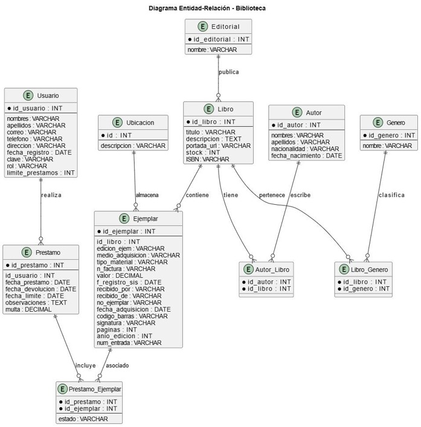

# Análisis de la Empresa

## 1. Datos Generales
- **Nombre:** Biblioteca COTECNOVA
- **Giro del negocio:** Gestión del catálogo bibliográfico y administración del préstamo e inventario de libros de una biblioteca institucional.
- **Tamaño:** Pequeña

## 2. Procesos Clave
- **Ventas:** El negocio no maneja ventas comerciales; se opera un servicio de préstamo de libros. Cada préstamo registra fecha de préstamo, fecha límite de devolución, fecha real de devolución y si aplica, el valor de la multa por retraso. El dashboard calcula sobre estos datos indicadores como préstamos activos, préstamos vencidos y multas pendientes.
- **Compras:** La biblioteca adquiere nuevos títulos a distintas editoriales o diferentes librerías (por ejemplo Pearson, McGraw-Hill, Alfaomega, Planeta, Trillas, Norma, Anaya, Penguin Random House, O'Reilly Media y Santillana) para ampliar el catálogo dependiendo las necesidades de los estudiantes y profesores.
- **Inventario:** Cada libro registra un campo `stock` que indica la cantidad de ejemplares disponibles. El sistema alerta cuando el stock de un título cae por debajo de un umbral mínimo. A nivel de modelo de negocio cada libro puede tener varios ejemplares físicos individuales, cada uno con su propia ubicación, código de barras, signatura y fecha de adquisición.
- **Otros:** Los usuarios se identifican con el tipo de identificación (CC.TI. etc) y el número de este, editoriales y géneros como catálogos de apoyo. Por ahora solo se tiene el rol de administrador (Bibliotecario) permitiendo visualizar el panel de administrador (dashboard) con la lista de libros, usuarios con su correo verificado, prestamos y multas.

## 3. Entidades Identificadas (Tablas)

**Implementadas en la base de datos (con migraciones):**
- Usuarios (`users`)
- Editoriales (`editorials`)
- Géneros (`generos`)
- Libros (`libros`)

**Identificadas en el modelo de negocio, usadas actualmente solo como datos de apoyo (datos CSV simulados) para las estadísticas del dashboard, aún no migradas a la base de datos:**
- Autor
- Ejemplar (copia física individual de un libro: código de barras, signatura, ubicación, fecha de adquisición)
- Ubicación (zona/estante/nivel donde se guarda cada ejemplar)
- Préstamo (registro de préstamo por usuario, con fechas y multas)
- Tablas de relación: libro-género (muchos a muchos), autor-libro (muchos a muchos), préstamo-ejemplar

Estas entidades son las utilizadas en este avance del proyecto ayudándonos como tal a generar un sistema funcional `users`, `editorials`, `generos` y `libros`.

## 4. Diccionario de Datos

### Tabla: users
| Campo | Tipo | Descripción |
|---|---|---|
| id | BIGINT | Identificador único del usuario |
| name | VARCHAR(255) | Nombre del usuario |
| tipo_identificacion | VARCHAR(10), nullable | Tipo de documento de identificación (CC, TI, etc.) |
| numero_identificacion | VARCHAR(30), nullable | Número del documento de identificación |
| email | VARCHAR(255), único | Correo electrónico del usuario |
| email_verified_at | TIMESTAMP, nullable | Fecha de verificación del correo |
| password | VARCHAR(255) | Contraseña encriptada |
| remember_token | VARCHAR(100), nullable | Token para sesión persistente |
| created_at | TIMESTAMP | Fecha de creación del registro |
| updated_at | TIMESTAMP | Fecha de última actualización |

### Tabla: editorials
| Campo | Tipo | Descripción |
|---|---|---|
| id | BIGINT | Identificador único de la editorial |
| nombre | VARCHAR(100) | Nombre de la casa editorial |
| created_at | TIMESTAMP | Fecha de creación del registro |
| updated_at | TIMESTAMP | Fecha de última actualización |

### Tabla: generos
| Campo | Tipo | Descripción |
|---|---|---|
| id | BIGINT | Identificador único del género |
| nombre | VARCHAR(50) | Nombre del género o categoría temática del libro |
| created_at | TIMESTAMP | Fecha de creación del registro |
| updated_at | TIMESTAMP | Fecha de última actualización |

### Tabla: libros
| Campo | Tipo | Descripción |
|---|---|---|
| id | BIGINT | Identificador único del libro |
| titulo | VARCHAR(150) | Título del libro |
| descripcion | TEXT, nullable | Breve descripción o sinopsis del libro |
| portada_url | VARCHAR(255), nullable | URL de la imagen de portada |
| stock | INTEGER, default 0 | Cantidad de ejemplares disponibles para préstamo |
| isbn | VARCHAR(20), nullable | Código ISBN del libro |
| editorial_id | BIGINT, FK → editorials.id | Editorial que publicó el libro |
| genero_id | BIGINT, FK → generos.id | Género temático del libro |
| created_at | TIMESTAMP | Fecha de creación del registro |
| updated_at | TIMESTAMP | Fecha de última actualización |

## 5. Diagrama Entidad-Relación (MER)

**Relaciones principales (entidades implementadas):**
- `Editorial` 1:N `Libro` (una editorial publica muchos libros; cada libro pertenece a una editorial)
- `Genero` 1:N `Libro` (un género agrupa muchos libros; cada libro pertenece a un género)
- `User` consulta y gestiona el catálogo (autenticación para administrar libros, editoriales y géneros)
